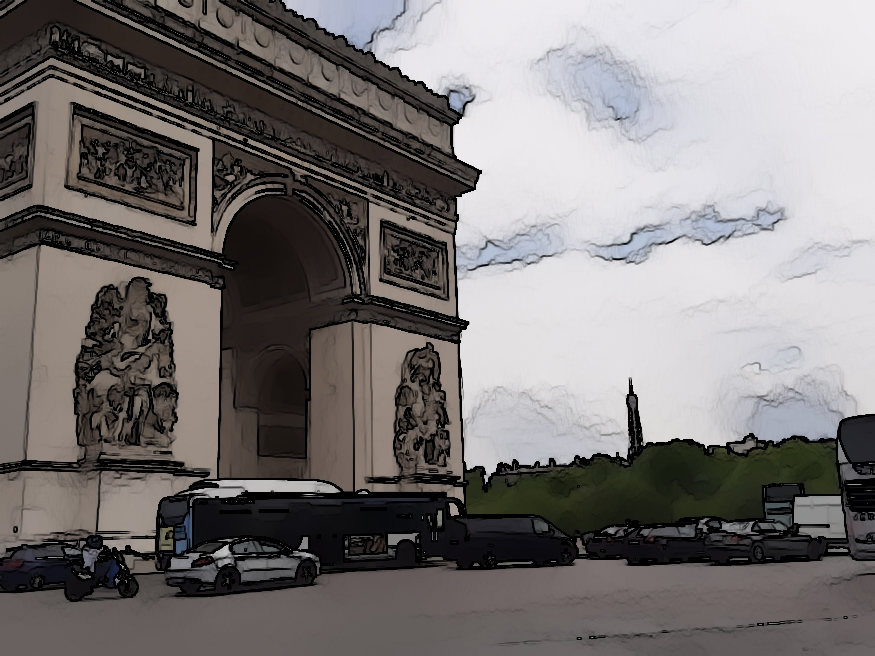

# ImageEffects

This project helps one to convert picture to pencil sketch and paintings. It also helps to cartoonify the image. 

This is built using OpenCV.It is converted to web app using Streamlit.
# Original Image
 
# Pencil sketch
 
# Cartoon
 
# Water Painting
 

# Web App
 
<ul>
  <li>pip install streamlit </li>
  <li> streamlit run app.py (run in conda env)</li>
  </ul>
  
